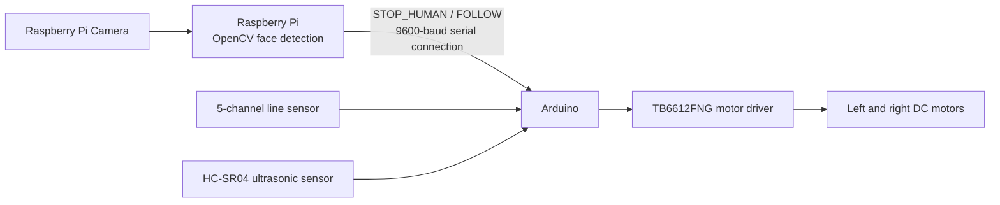

# Vision-Assisted Autonomous Car

This autonomous vehicle prototype was developed as a university graduation project. The vehicle follows a line, detects obstacles with an ultrasonic sensor and changes lanes, and stops for safety when a human face is detected by the Raspberry Pi camera.

## Features

- Line following with a five-channel infrared sensor array
- Obstacle detection using an HC-SR04 ultrasonic sensor
- State-machine-based automatic lane changing
- Real-time face detection using a Raspberry Pi Camera and OpenCV
- Serial stop command sent to the Arduino when a face is detected
- Controlled return to line-following mode after the face leaves the frame
- Serial monitoring of sensor readings, distance, lane, state, and movement data

## System Architecture



The Arduino handles the vehicle's real-time motion control. The Raspberry Pi acts as the image-processing layer and sends only the safety-related `STOP_HUMAN` and `FOLLOW` commands.

## Hardware

- Arduino Uno, Nano, or a compatible board
- Raspberry Pi and Raspberry Pi Camera
- TB6612FNG dual motor driver
- Two DC motors and a vehicle chassis
- Five-channel digital line-tracking sensor
- HC-SR04 ultrasonic distance sensor
- Suitable power supplies for the motors and control circuitry
- USB serial connection between the Arduino and Raspberry Pi

> Board and module models may be changed according to the hardware used in the prototype. Always verify PWM support and logic voltage levels before making the connections.

## Arduino Pin Connections

| Function | Arduino pin |
|---|---:|
| Motor driver `STBY` | D4 |
| Left motor `PWMA` | D5 (PWM) |
| Left motor `AIN1` | D7 |
| Left motor `AIN2` | D8 |
| Right motor `PWMB` | D6 (PWM) |
| Right motor `BIN1` | D9 |
| Right motor `BIN2` | D10 |
| HC-SR04 `TRIG` | D2 |
| HC-SR04 `ECHO` | D3 |
| Line sensor S1 | A0 |
| Line sensor S2 | A1 |
| Line sensor S3 | A2 |
| Line sensor S4 | A3 |
| Line sensor S5 | A4 |

Do not power the motors from the Arduino's 5 V pin. Power the motor driver from a suitable external source and connect the grounds of the Arduino, Raspberry Pi, and motor driver. Never apply 5 V directly to the Raspberry Pi GPIO pins.

## Project Structure

```text
.
├── arduino/
│   └── autonomouscar/
│       └── AutonomousCar-3/
│           └── AutonomousCar-3.ino
├── raspberry_pi/
│   ├── main.py
│   └── requirements.txt
└── README.md
```

## Installation

### 1. Arduino Software

1. Open `arduino/autonomouscar/AutonomousCar-3/AutonomousCar-3.ino` in the Arduino IDE.
2. Select the correct board and serial port.
3. Upload the sketch to the Arduino.
4. If necessary, set `INNER_LANE_IS_LEFT` according to the track direction:

```cpp
const bool INNER_LANE_IS_LEFT = true;
```

Use `true` if the inner lane is on the left relative to the vehicle's direction of travel, or `false` if it is on the right.

### 2. Raspberry Pi Software

Make sure that camera support is enabled on Raspberry Pi OS and that the camera is connected. Then run:

```bash
sudo apt update
sudo apt install -y python3-picamera2 python3-opencv python3-venv
cd raspberry_pi
python3 -m venv --system-site-packages .venv
source .venv/bin/activate
pip install -r requirements.txt
```

Use one of the following commands to find the Arduino's serial port:

```bash
ls /dev/ttyUSB*
ls /dev/ttyACM*
```

Update the setting in `raspberry_pi/main.py` to match the detected port:

```python
SERIAL_PORT = "/dev/ttyUSB0"
BAUDRATE = 9600
```

If access to the serial port is denied, add the current user to the `dialout` group and then log out and back in:

```bash
sudo usermod -aG dialout $USER
```

## Running the Project

Connect the Arduino to the Raspberry Pi via USB. During the first test, raise the vehicle so that its wheels cannot touch the ground, and then start the Raspberry Pi application:

```bash
cd raspberry_pi
source .venv/bin/activate
python3 main.py
```

Press `q` to close the camera window. For headless operation, set `SHOW_CAMERA` to `False` in `main.py`.

## How It Works

1. The Arduino reads the five digital line sensors and independently adjusts the left and right motor speeds.
2. If the ultrasonic sensor detects an obstacle at or within 25 cm in two consecutive measurements, the lane-change sequence begins.
3. The vehicle leaves its current lane, searches for the target lane, and realigns itself after detecting the line.
4. The Raspberry Pi searches each camera frame for a face using a Haar Cascade classifier.
5. When a face is confirmed in three consecutive frames, `STOP_HUMAN` is sent to the Arduino and the motors stop.
6. When no face has been visible for 2.5 seconds, the `FOLLOW` command is sent and the vehicle returns to line-following mode.

## Serial Commands

| Command | Result |
|---|---|
| `STOP_HUMAN`, `STOP`, `PERSON` | Stops the vehicle immediately |
| `FOLLOW`, `CLEAR`, `RESUME` | Clears the stop state and resumes line following |

Commands must end with a newline character, and the connection must be configured at `9600 baud`.

## Configuration

The following values in the Arduino sketch can be calibrated for the track and vehicle mechanics:

- `forwardSpeed`: straight-line speed
- `softFastSpeed` / `softSlowSpeed`: gentle-turn motor speeds
- `hardFastSpeed` / `hardSlowSpeed`: sharp-turn motor speeds
- `obstacleCm`: obstacle detection distance
- `laneLeaveMs`, `laneIgnoreLineMs`, `laneFindTimeoutMs`, `laneAlignMs`: lane-change timing values

Important Raspberry Pi settings include:

- `CAMERA_WIDTH`, `CAMERA_HEIGHT`: camera resolution
- `FACE_SCALE_FACTOR`, `FACE_MIN_NEIGHBORS`, `FACE_MIN_SIZE`: face-detection sensitivity
- `FACE_CONFIRM_FRAMES`: number of frames required to confirm a face
- `FACE_CLEAR_TIME`: delay before resuming after a face disappears
- `SHOW_CAMERA`: enables or disables the preview window

## Troubleshooting

- **The motors rotate in the wrong direction:** Swap the motor wires or reverse the motor direction logic in the Arduino sketch.
- **The vehicle does not read the line correctly:** Check the sensor height and threshold settings. The code assumes that a sensor outputs `LOW (0)` when it detects the line.
- **The Arduino serial port cannot be found:** Change `SERIAL_PORT` to `/dev/ttyACM0` or the port shown by the operating system.
- **The camera does not start:** Check the camera cable and Raspberry Pi camera configuration, and test the camera using the `libcamera` or `rpicam` tools.
- **The Cascade file cannot be found:** Make sure the OpenCV data files are installed. The application automatically searches the standard OpenCV directories.
- **The lane change finishes too early or too late:** Recalibrate the timing constants and motor speeds for the dimensions of the track.

## Safety Notice

This project is intended for education and prototyping only. It must not be used in real traffic or in environments where human safety is critical. Perform initial tests at low speed, in a controlled area, and with the wheels raised from the ground. A physical emergency stop switch is recommended.

## Contributing and License

Issues and pull requests are welcome. Before publishing the project as open source, add a `LICENSE` file containing your preferred license.
